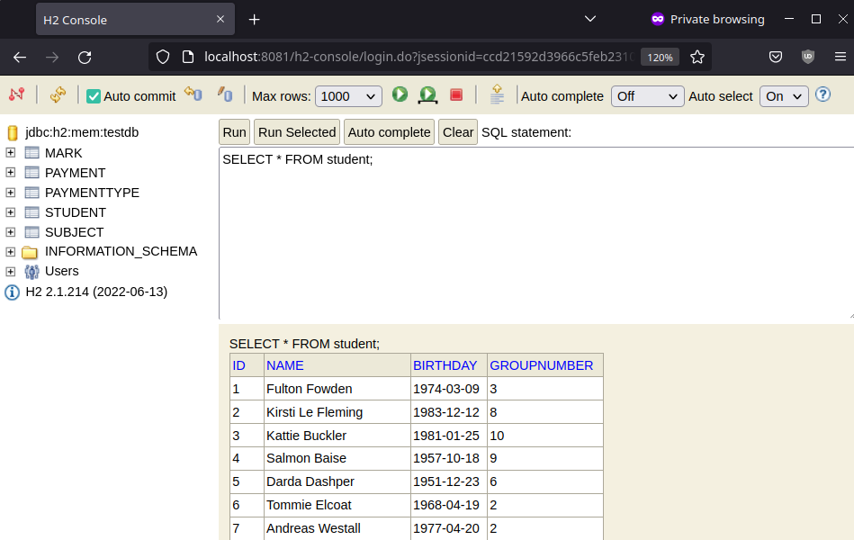

This project helps to test your SQL statement for the task
[Task #1. SQL](https://github.com/mjc-school/stage2-module3-SQL-tasks).

To take the H2 database available and populated with initial data, run the `main` method
from one of `InitH2` classes.

## Using Maven

At first, we need to compile a project

```shell
mvn compile
```

If we want to initialize H2 for the 7th lesson and make a console available on port 8081 we run this command

```shell
mvn exec:java -pl lesson7 -Dexec.mainClass=com.mjc.stage2.InitH2 -D--server.port=8081 
```

It starts Spring WebApplication with an embedded in memory H2 database with the H2 console
available on the `localhost:8081/h2-console`. So remember that the database is available and exists only while
the application is running.


To connect to a database we go to the `localhost:8081/h2-console` and connect to URL 
`jdbc:h2:mem:testdb` as user `sa` with an empty password.



If the port 8080 is available the flag `-D--server.port=8081` can be omitted, and
the server will start on the default `8080` port.
